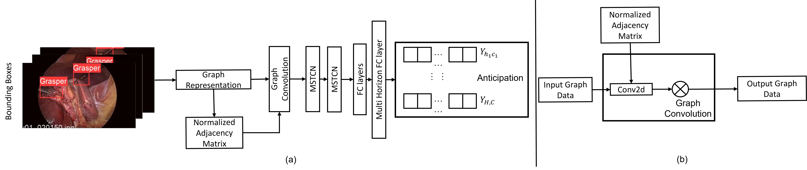

# Towards Graph Representation Learning Based Surgical Workflow Anticipation
Example Code for the paper Towards Graph Representation Learning Based Surgical Workflow Anticipation



## Environment Setup
First please create an appropriate environment using conda: 

> conda env create -f surgery.yaml
> 
> conda activate surgery

## Test Pre-Trained Models
Evaluate on Sample dataset:
> python main_infer.py


## Train a Model
Train on Sample dataset:
> python main.py

In training, our default stream is only based on graph-level information, as we proposed in our paper.

## Citing

If you find this work useful, please consider our paper to cite:

```
@inproceedings{zhang24Depth,
 author={Zhang, Francis Xiatian and Chen, Shuang and Xie, Xianghua and Shum, Hubert P. H.},
 booktitle={Proceedings of the 2024 International Conference on Medical Image Computing and Computer Assisted Intervention},
 series={MICCAI '24},
 title={Depth-Aware Endoscopic Video Inpainting},
 year={2024},
 publisher={Springer},
 location={Marrakesh, Morocco},
}
```
